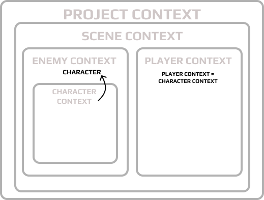

# Character Documentation ([rus](Character_ru.md))
- [Back to Main README](../README.md)

This document describes the key game entities: Character, Player, Enemy, and their interactions. It covers their installers and dependency integration methods.

The project utilizes core game entities: **Character**, **Player**, **Enemy**, **Weapon**, and the **UI system**. They interact through a context system managed by **Zenject**, allowing for flexible dependency configuration and easy feature expansion. **GameObject Context** helps structure connections between characters, weapons, and UI elements, ensuring modularity and seamless integration of new mechanics.

## Main Prefabs

- **Character** – Base game entity.
- **Enemy** – Prefab for enemies, utilizing **Character**.
- **Player** – Prefab for the player, utilizing **Character**.
- **HealthBar**, **ReloadBar**, **LookDirectionDisplay** – UI components.
- **Weapon** – Weapon prefab.
- **EnemySpawner**, **OnceEnemySpawner**, **RepeatableEnemySpawner** – Enemy spawning systems.

## Installers

Zenject installers are used to configure dependencies and manage contexts. More information on installers can be found in the [official Zenject documentation](https://github.com/modesttree/Zenject?tab=readme-ov-file#installers).

### **CharacterInstaller**

- Configures dependencies for **Character**.
- Injects **ICharacterSettings**, **IFriendOrFoeTag**, **IDamageCalculator**, **IWeaponOwner**.
- Connects UI elements and effects.

### **EnemyInstaller**

- Injects **EnemySettings** and **IAIBehaviourInstaller**.
- Creates **Character** using a sub-container.

### **PlayerInstaller**

- Injects **IPlayerSettings** and **IFriendOrFoeTag**.
- Adds **Character** and links input handling via **PlayerInputAdapter**.

### **PlayerControllerInstaller**

- Injects **PlayerInputAdapter**, **IMovable**, **MonoTicker**.
- Manages player movement and attack input.

## Meta Entities

The project implements a prefab-variant system that allows code and settings reuse across different game entities. Each prefab carries additional logic, adapting the base **Character** functionality to specific gameplay needs such as player control or enemy AI behavior. Thanks to **GameObject Context** and dependency injection via **Zenject**, scripts are decoupled and receive their dependencies through the container, ensuring flexibility and easy extensibility.

### **Character**

- Serves as the foundation for **Player** and **Enemy**.
- Associated with **ICharacterSettings**, **IWeaponOwner**, **IHaveHealth**.
- Manages health, attacks, movement, and weapon interactions.

### **Enemy**

- Uses **Character**.
- Has no separate class, functioning through **Character** with enemy-specific settings.
- Receives parameters from **EnemySettings**.
- Configured via **EnemyInstaller**.

### **Player**

- Uses **Character**.
- Controlled via **PlayerInputAdapter**.
- Configured via **PlayerInstaller**.

## Subsystems

### **Combat System**

- **IWeapon**, **IWeaponOwner**, **ICanFire**, **ICanReload** – Weapon mechanics.
- **IDamageCalculator** – Damage calculation.

### **Movement System**

- **IMovable** – Interface for movement handling.
- **MoveBehaviour** – Movement logic via **Rigidbody**.

### **AI System**

The AI system manages enemy behavior and interactions with the environment. It is implemented through **IAIBehaviourInstaller**, which configures and controls various AI strategies.

#### **Core Components**

- **IAIBehaviourInstaller** – Interface for AI logic configuration.
- **EnemySpawner** – Spawns enemies with predefined settings.
- **RepeatableEnemySpawner** – Spawns enemies with delays and quantity limits.
- **AI State Machine** – State-based behavior control (e.g., patrolling, attacking, chasing).

#### **Workflow**

1. **Enemies are spawned via EnemySpawner**, receiving dependencies through Zenject.
2. **IAIBehaviourInstaller** configures movement and attack logic.
3. **AI State Machine** switches enemy states based on game events.
4. **RepeatableEnemySpawner** generates new enemies when the count drops below the threshold.

This modular structure allows easy expansion and modification of enemy behavior without rewriting base AI logic.

### **UI System**

- **HealthBar**, **ReloadBar**, **LookDirectionDisplay** – UI elements.
- **CharacterColorFeedback** – Visual feedback for damage.

### **Input System**

- **IInputController** – Handles player input.
- **PlayerInputAdapter** – Links input to character actions.

### **Friend or Foe System**

- **FriendOrFoeComponent** – Determines allies and enemies.
- **IFriendOrFoeTag** – Identifies character team alignment.

---

## Entity Interactions

| Entity    | Interacts With         | Key Dependencies                        |
|-----------|------------------------|-----------------------------------------|
| Character | Player, Enemy           | ICharacterSettings, IWeaponOwner, IHaveHealth |
| Player    | Character               | PlayerInputAdapter, IPlayerSettings     |
| Enemy     | Character, AI System    | EnemySettings, IAIBehaviourInstaller    |
| Weapon    | Character, Player, Enemy | IWeaponOwner, ICanFire, ICanReload      |
| Spawners  | EnemyFactory            | EnemySettings                           |
| UI        | Character, Player       | HealthBar, ReloadBar, LookDirectionDisplay |

## [Examples](Character_example.md)